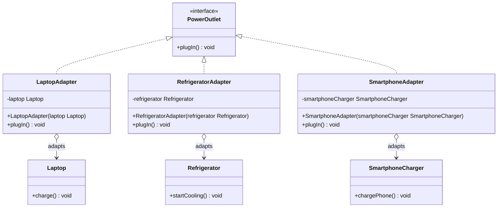

# Plugging Devices into Power Outlets

## Problem Statement

You are developing an application that helps users manage and control various electronic devices by plugging them into power outlets. Each device has different plug types, voltage, and amperage requirements. To ensure compatibility and safety, you need to create adapters for different devices to allow them to be plugged into standard power outlets.

### Adaptee Objects

- **Laptop** - Represents a laptop device that needs to be plugged into a power source. It has the `charge()` method.
- **Refrigerator** - Represents a refrigerator device that requires a power source. It has the `startCooling()` method.
- **SmartphoneCharger** - Represents a smartphone charger that needs to be plugged in for charging. It has the `chargePhone()` method.

### Target Object

- **PowerOutlet** - Represents a standard power outlet with a common interface for plugging in devices. It defines the `plugIn()` method as the target method.

### Adapter Objects

- **LaptopAdapter** - An adapter for plugging a laptop into a standard power outlet. It adapts the `Laptop` to the `PowerOutlet` interface, translating `plugIn()` to `charge()`.
- **RefrigeratorAdapter** - An adapter for plugging a refrigerator into a standard power outlet. It adapts the `Refrigerator` to the `PowerOutlet` interface, translating `plugIn()` to `startCooling()`.
- **SmartphoneAdapter** - An adapter for plugging a smartphone charger into a standard power outlet. It adapts the `SmartphoneCharger` to the `PowerOutlet` interface, translating `plugIn()` to `chargePhone()`.

## UML Class Diagram



## Java Source Code

The complete Java solution is in the [`src`](src) directory:

- [`PowerOutlet.java`](src/PowerOutlet.java) - Target interface.
- [`Laptop.java`](src/Laptop.java), [`Refrigerator.java`](src/Refrigerator.java), [`SmartphoneCharger.java`](src/SmartphoneCharger.java) - Adaptees.
- [`LaptopAdapter.java`](src/LaptopAdapter.java), [`RefrigeratorAdapter.java`](src/RefrigeratorAdapter.java), [`SmartphoneAdapter.java`](src/SmartphoneAdapter.java) - Adapters.
- [`Main.java`](src/Main.java) - Example client.

## Run the Example

```bash
javac -d out src/*.java
java -cp out Main
```

Expected output:

```text
Laptop is charging.
Refrigerator is cooling.
Smartphone is charging.
```